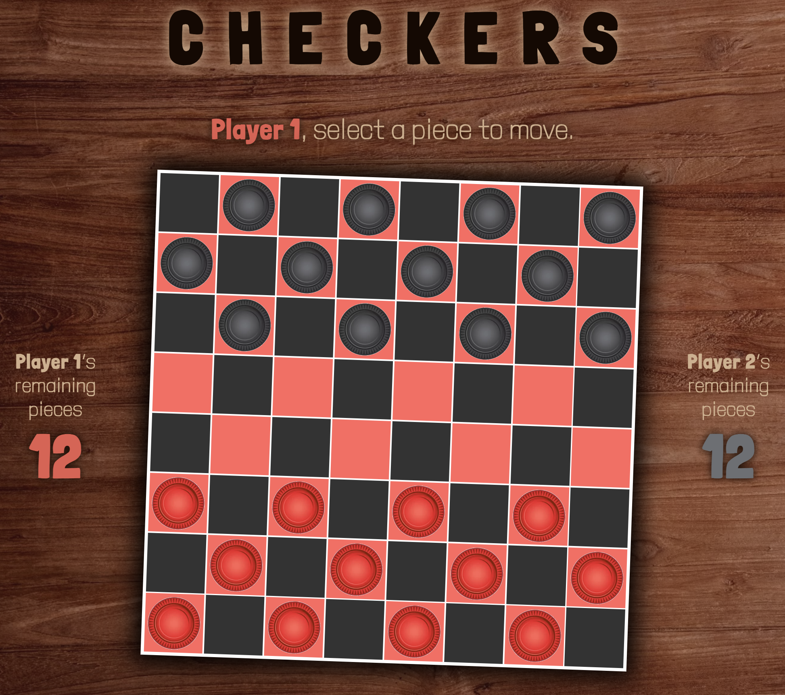
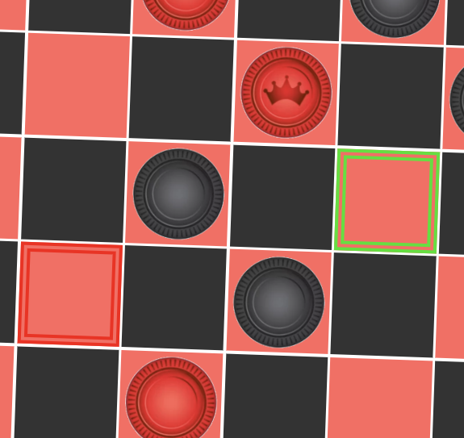

# CHECKERS

## The timeless classic, now on digital mahogany!

You know it. You love it. It's here again, and ... it's pretty much just as you remember it. In an effort to conform to global efforts to preserve our planet's precious, limited resources, **we're replacing all cardboard and plastic with binary bits of electronic magic!** Now you can enjoy CHECKERS with your loved ones, knowing that you're doing your part to save the planet while playing!

---

Visual representation of possible moves. Be nice and maintain friendships; choose green. Or, choose red ... and face the consequences!

---

### Technologies used:

- HTML

- CSS

- JavaScript

### Game assets:

A big shoutout to **Google** for their images (player pawns) and fonts!

---

## Want to play? Here you go!

You can find the current deployment of CHECKERS by [clicking this link](https://jskartes.github.io/checkers/)!

### Some things to look forward to ...

Have you chosen the blinking red square too many times, and now have nobody to play with? Well, have I got a (future) solution! When I have the wherewithal to make your computer a savvy-enough CHECKERS player, you'll be able to test your mettle against it in **AI Opponent Mode**.

So, you *do* regret clicking the blinking red square. Your friend's accusatory side-eye is causing you immense shame. If only time travel were truly possible ... Well, eventually, it might be! Possibly coming soon to a CHECKERS board near you: **Undo Move** functionality. And just like that, friendship restabilized.
